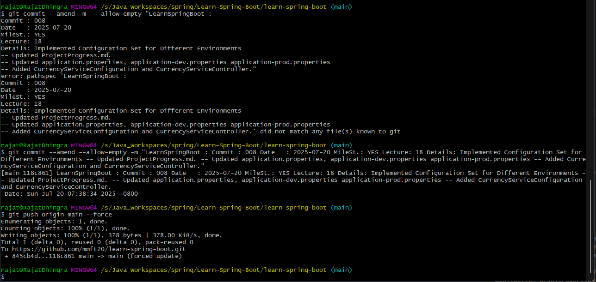

## Project Progress

Date : 2025-07-14
    
    --Completed Till Lecture 11.

Date : 2025-07-15

    Revision
    -- Created Spring Project using Spring Initializer. 
    -- Link : https://start.spring.io/
    -- IMPORTANT : The project must be imported as a MAVEN Project.
    -- Ran the Spring Project using @SpringApplication annotation class.
    -- Created COURSE class with Parametrized constructor and Getter + toString Method.
    -- Built Simple REST API to retrieve All courses.
    -- Data Was Returned by returning a list of courses initialized/created using new objects.
       An array of new objects ws creted and was converted to list using asList functions from Arrays class.

___
 
    Lecture 12
    -- Spring Boot helps in building app QUICKLY and PROD Ready
    * Spring Initializr - Create Project Structure quickly.
    * Spring Boot Starter Project - To Include dependecies based on the type of project that we want to craete.
    * SB Auto Configuration - To Auto configure basic properties of the included Dependencies in above step.
    * SB Dev Tools - To Update project without Re-Starting the Application

    -- Prod Ready
    * Logging
    * Diif cfg for diff Env.
    * Monitoring ( Spring Boot Actuator ).

---
    Lecture 13
    -- So far our #pom.xml has
    1. spring-boot-starter-web : REST API + Web Application
        -- spring-boot-starter : To Launch Spring Context.
        -- spring-boot-starter-json : Bean to JSON and JSON to Bean Conversion.
        -- spring-boot-starter-tomcat : To Run application using TOMCAT.
        -- spring-web    : Spring MVC Framwork for REST API.
        -- spring-webmvc : Spring MVC Framwork for REST API.

    2. spring-boot-starter-test : For writing UNIT tests.

---
    Lecture 14
    Configuration is base on the Dependencies/Project included in the ClassPath.
    -- The dependencies to be included in classpath are added by updating/including them in #pom.xml.
    
    Spring Boot provides basic AUTO CONFIGURATION for all dependencies/starter-projects included.
    -- The above default configuration can always be overwrittem/updates as per need.
    -- Defaul cfg prevent us from writing cfg in the begiining and follow basic best practices so are good for starting a project.

Date : 2025-07-15

    Lecture 15
    -- How to implement SB Devtools
    -- Devtools automatically updates project whenever any changes are made to the project.
    -- We need not re-start the application post saving the changes, for changes to take effect.
    -- Devtools takes care of it.
    -- Devtools is setup by adding it as a dependency in pom.xml.
    -- NOTE : For changes in pom.xml we need to restart the application for it to take effect.
    
    ## Issue while setting up Devtools.
    -- Devtools wasnt wrking post addition to pom.xml and re-start of application 2-3 times.
    -- IntelliJ IDE must also have the following two settings for Devtools to be effective.
    1. Settings -> Build,Execution,Deploymenet -> Compiler -> "Build project Automatically" must be checked.
    2. Settings -> Advanced Setting -> "Allow auto make to start even if application is currently running" must be checked.
    Ref Link : https://www.youtube.com/watch?v=BvIM9gNTDM4

---

    Lecture 16
    -- How Spring BOOT helps us in being PROD ready.
    -- We learn about Spring Profiles.
    -- Profiles are helpful in managing project settings for different project Profiles.
    -- Project could be in Dev, QA, Prod environment.
    -- For Different Env we might need Env specific settings.
    -- For example we need to connect to different DB in diff environment.
       We need different level of logging in diff env. Etc.
    -- This is achieved by Profiling.
    -- we set different application.properties for diff env.
    -- application.properties  --> Default property file
       application-dev.properties --> For DEV Env.
       application-prod.properties --> For PROD Env.
    -- "spring.profiles.active=dev" --> refers to env being dev. this is mentioned in the default file i.e. application.properties.

---

    Lecture 17
    -- Some infor about instructor.
    -- Not much useful.

Date : 2025-07-19

    Lecture 18
    -- How to build a Configuration Service.
    -- A CurrencyServiceConfiguration class was craeted with following annotation
    @ConfigurationProperties -> To depict that this class is for setting up configurations.
    **** The @ConfigurationProperties annotation in Spring Boot is a powerful way to bind external configuration (like values from application.properties or application.yml)
         directly to Java objects in a type-safe and organized manner.
    ****
    @Component -> So that the class is managed by Spring boot.
    -- All the instance variable of this class were basically the configuration parameters that were needed.
    -- The parameters defined in the class : url, username, key. 
    @ConfigurationProperties(prefix = "currency-service") 
    Above is how the annotation is written in the class.
    The prefix suggest how to set-up/look-up properties in the properties file.
    So for url we will look up the property : currency-service.url and simlarly currency-service.username and currency-service.key for UserName and Key.
    Now we can setup these values in different files for different environments
    In application.properties    < Default Values go here >
        currency-service.url=https://alpha.com
        currency-service.username=defaultUser
        currency-service.key=defaultKey
    In application-dev.properties < For DEV Environment >
        currency-service.url=https://alpha-dev.com
        currency-service.username=devUser
        currency-service.key=devKeys

Date : 2025-07-20

    Lecture 19
    -- Used MAVEN clean install to carete .jar file in the target folder.
    -- Updated default jdk on windows machine to JDK 21 as JDK 8 was too old for Spring Boot 3.
    -- Ran the application using java -jar <jar name> from command prompt.

### IMPORTANT : How to update commit message for PUSHED change using gitBash

    Lecture 20
    -- Spring Actuator : To monitor the application.
    -- Actuator helps us monitor the following :
       Beans    : List of all APP Beans
       Health   : App Health info
       Metrics  : App metrics
       Mappings : Details around Requests Mappings.
    -- Required endpoints can be configured in application.properties
    -- The parameter to include various features is : "management.endpoints.web.exposure.include"